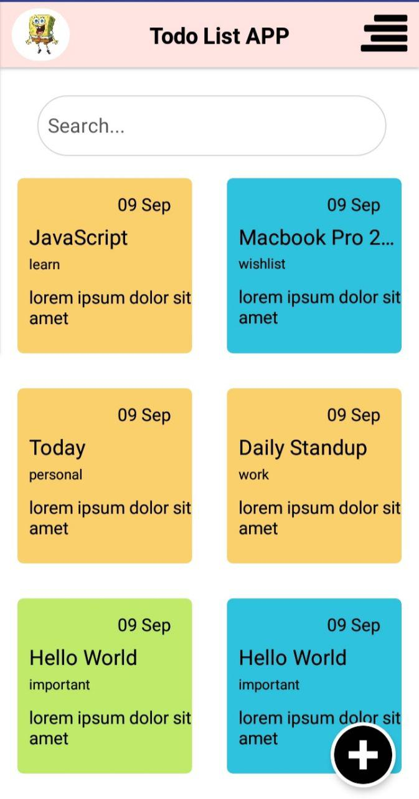
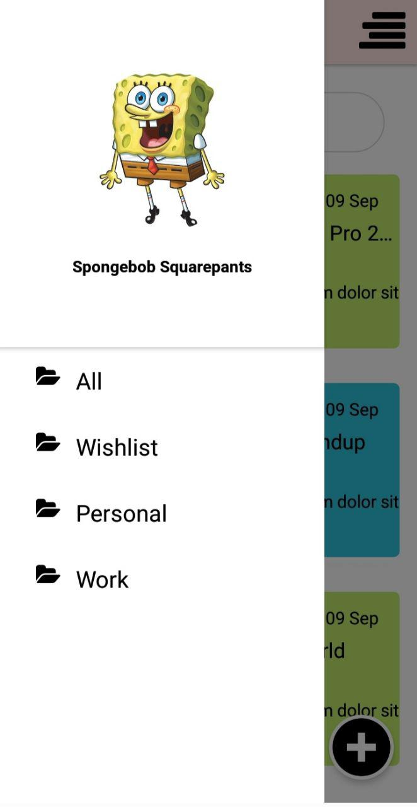
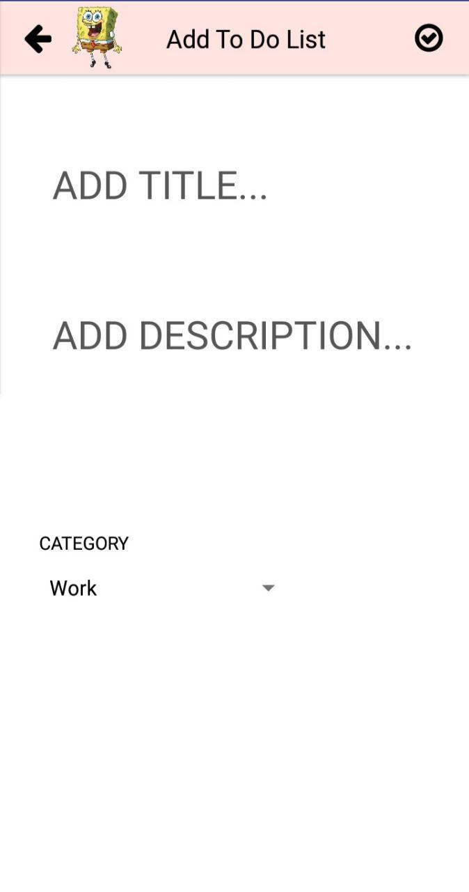

    <h1>ToDoList App</h1>

## Table of Contents

- [Table of Contents](#table-of-contents)
- [Introduction](#introduction)
- [Features](#features)
- [Requirements](#requirements)
- [Usage](#usage)
- [Screenshoot](#screenshoot)
- [Contributors](#contributors)

## Introduction

TodoList App is a simple app, that user can add a note

## Features

- Able to add book
- Able to edit book

## Requirements

- `npm`
- `react-native-cli`
- 

## Usage

- Clone or download this repo first
- Open your terminal or cmd and type `npm install` and `react-native link`
- Connect your phone to the pc or laptop and make sure your phone is connected with debugging mode
- Finnaly, type `react-native run-android` and wait for the process to complete

## Screenshoot

## Maker

  <table>
    <tr>
      <td align="center">
        <a href="https://github.com/Khusnijafar">
           
          <b>Khusni Jafar</b>
        </a>
      </td>
    </tr>
  </table>

